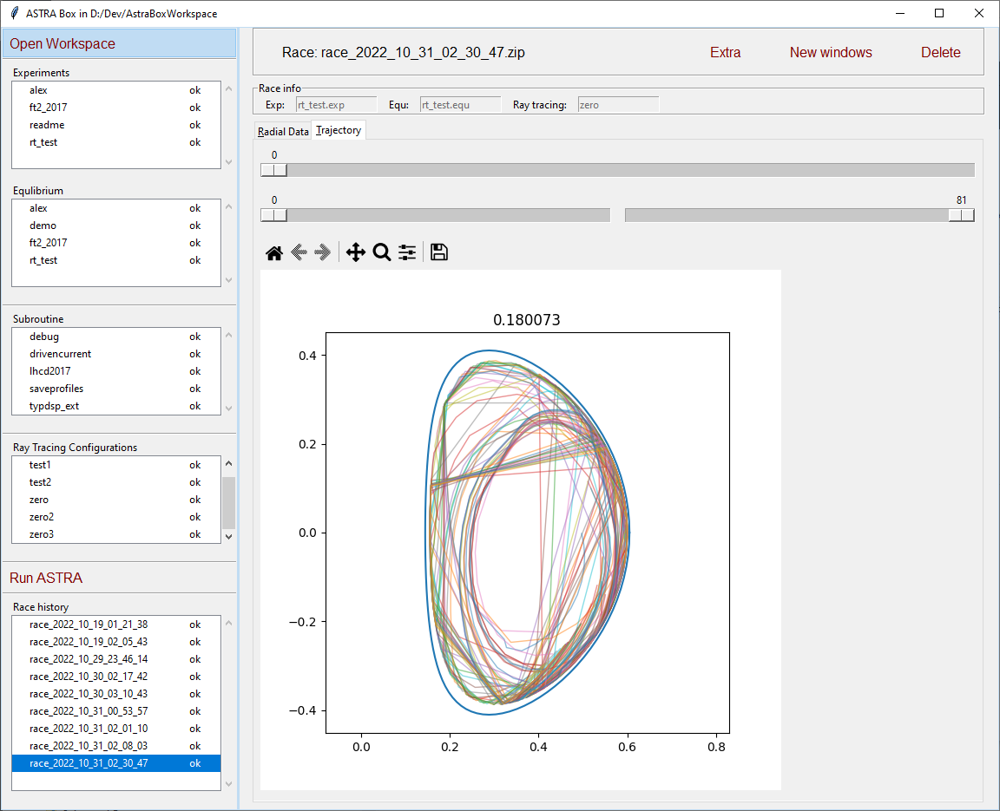

# Astra-Box

Python wrapper for ASTRA

Required for run: python 3.12, poetry, ASTRA on WSL2.

Doc ([rus](https://temper8.github.io/Astra-Box/))





1. Установка python для Windows:

    скачать дистрибутив с сайта https://www.python.org/

    запустить и выбрать опцию `add python.exe to PATH`


2. Установить менеджер зависимостей Poetry

    ```
    pip install poetry
    ```

3. Клонировать репозиторий Astra-Box
    ```
    git clone https://github.com/PopovLab/Astra-Box.git
    ```
3. Установить зависимости для Astra-Box

    ```
    cd my_projects\Astra-Box
    poetry install 
    ```

4. можно запустить 
    ```
    run.bat
    ```