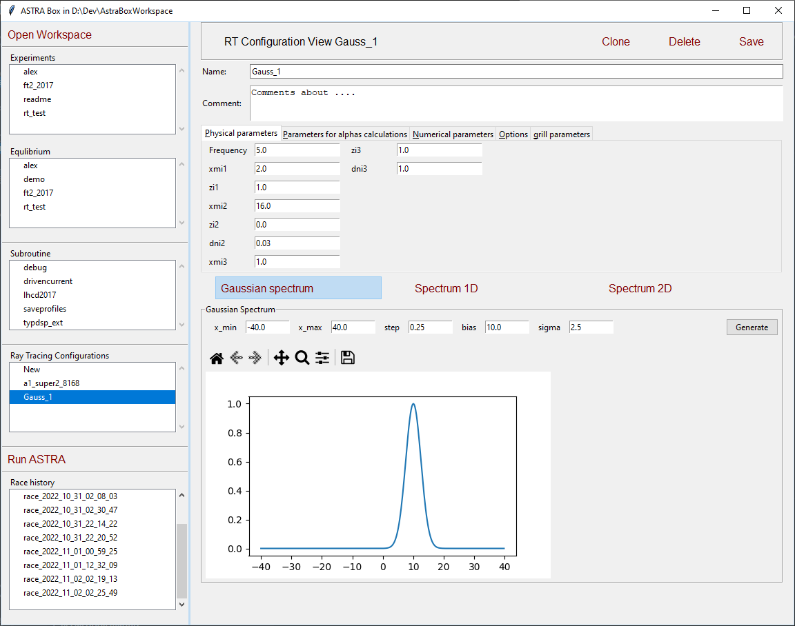
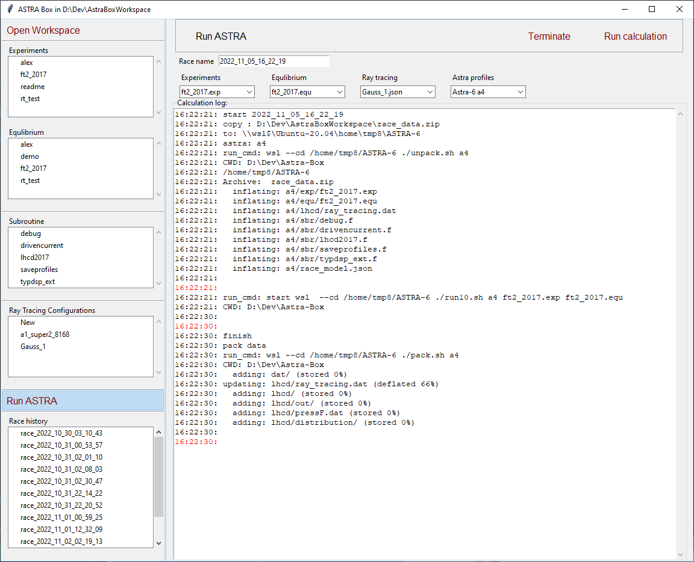
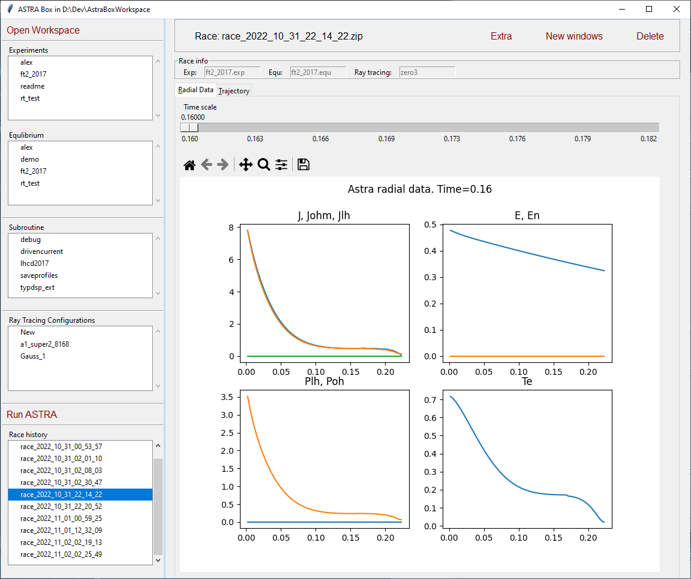
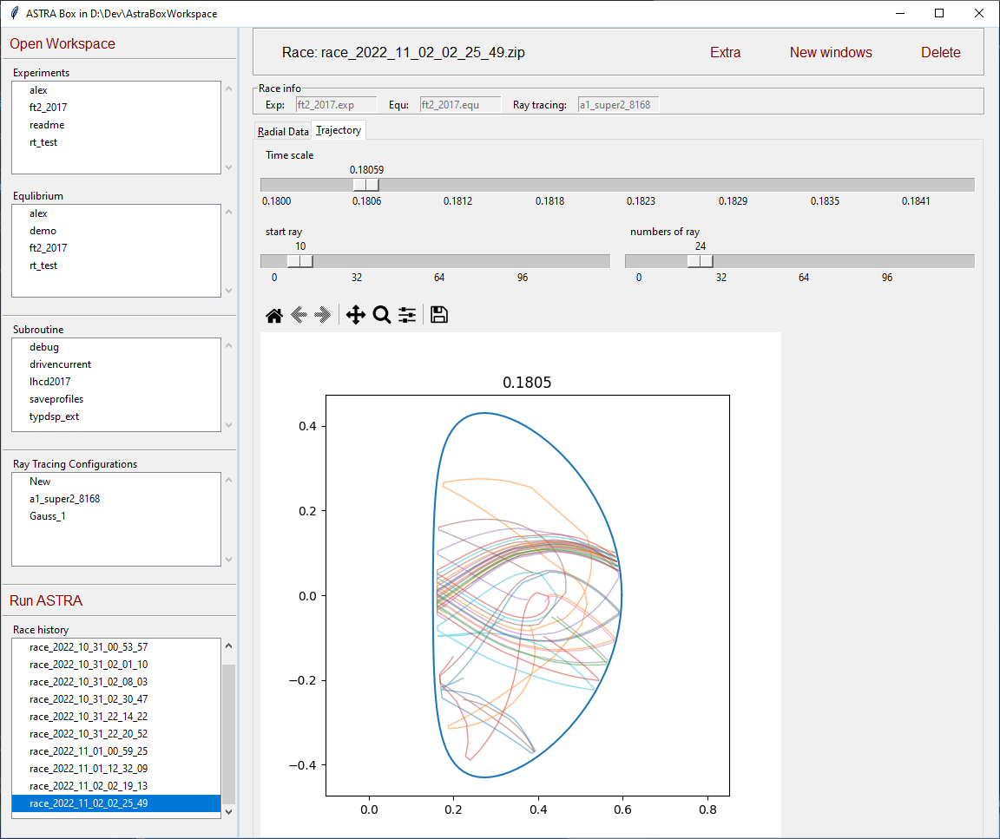

# Astra-Box

Astra-Box - приложение, для удобной работы c системой ASTRA. 
Позволяет создавать конфигурацию за расчетов, запускать её и анализировать результаты

Для работые требуется: python 3.10 и выше, и ASTRA в виртуальной машине WSL.

Как установить ([en](Installing_ENG.html), [rus](Installing_RUS.html))


Рабочее пространство:
```
Astra-box WrokSpace
│
├── exp 
│   │   readme.exp
│   │   rt2017.exp
│   
├── equ
│   │   demo.equ
│   │   rt2017.equ
│   
├── sbr
│   │   drivencurrent.f
│   │   lhcd2017.f   
│   
├───ray_tracing
│   │   Gauss_1.rt
│   │   a1_super2_8168.rt
│   
└───races
    │   race_2022_11_05_16_21_16.zip    
    │   race_2022_11_05_16_22_19.zip    
```

Интерфейс позволяет редактировать файлы Exp, Equ и Sbr.
Так же для трассировки лучей:


Запуск расчета:


Простмотр радиальных данных:


Траектории:

