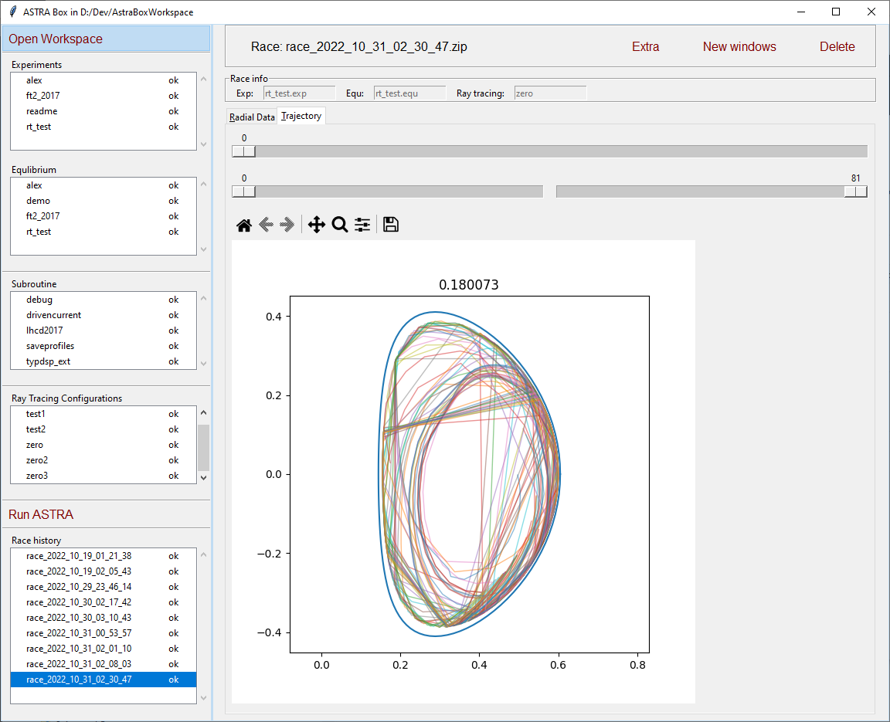

# Astra-Box

Astra-Box - приложение, для удобной работы c системой ASTRA. 
Позволяет создавать конфигурацию за расчетов и просмтривать результаты

Required for run: python 3.10, poetry, ASTRA on WSL.

How to run ([en](https://temper8.github.io/Astra-Box/HOW_TO_RUN_ENG.html), [rus](Installing_RUS.html))

